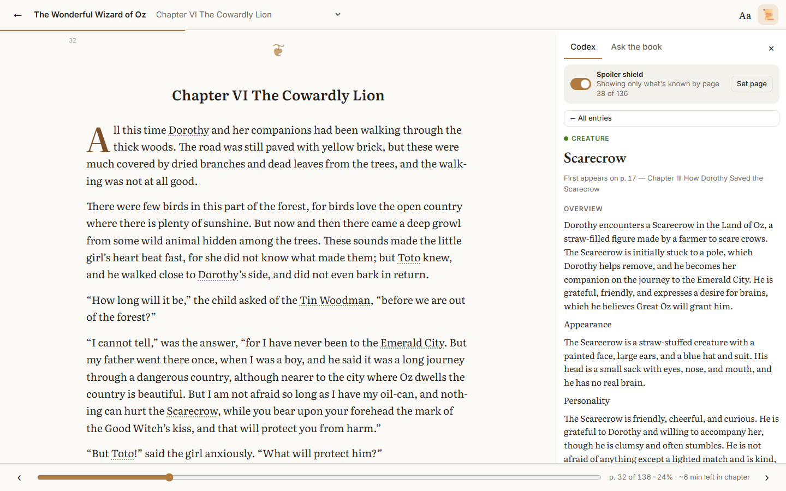
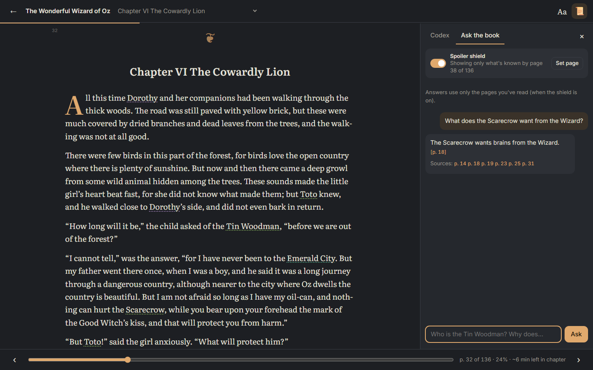
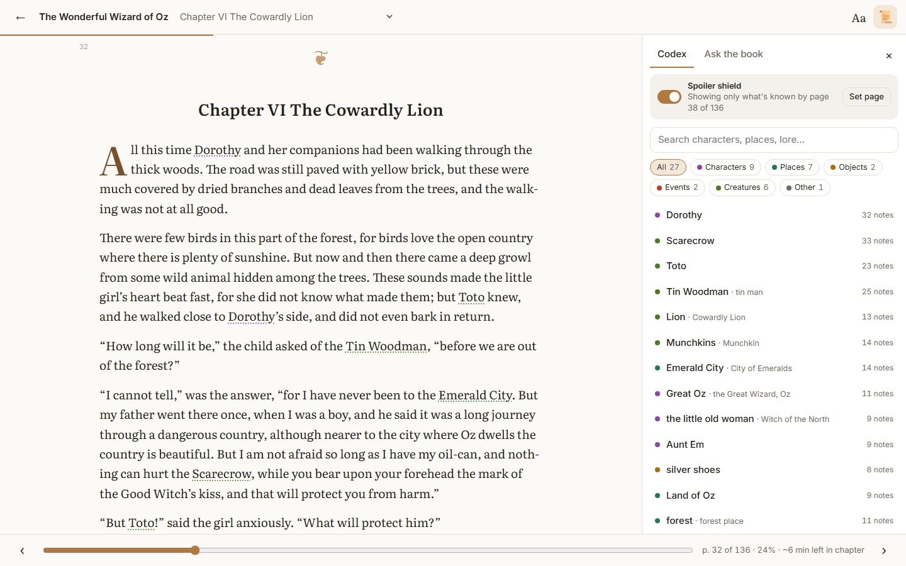

# Lorekeeper

**A spoiler-free companion for fantasy and sci-fi novels.** Lorekeeper reads your e-book, builds a
codex of everything unique in it, and only ever shows you what you've already read. The codex covers
characters, places, objects, events, lore, history, factions and creatures.

It runs entirely on open-weight AI models on your own GPU (through Ollama), or on a fast
OpenAI-compatible host such as Groq.



## Features

- **Continuous reader.** The whole book is one smooth scroll. Chapters open with a drop cap, and page
  numbers sit quietly in the margin. Your exact position is remembered.
- **Your look.** Choose from four themes (light, sepia, dark, true black) and eight fonts, then
  adjust text size, line height, page width, paragraph and letter spacing, justification and indents.
- **Codex.** Every entry has an AI-written overview and every fact the book gives, each with a
  clickable page reference and grouped by chapter. It also shows connected entries, mentions in other
  entries, and a chart of where the entry appears in the book.
- **Spoiler shield.** It advances as you read. Entries you haven't met are hidden. Known entries show
  only facts, names and aliases from pages you've read. If a character is secretly someone else, you
  see the name you knew at that point. The titles of unread chapters and the book's own table of
  contents are hidden too.
- **Names in the text.** Names you already know are underlined in the text. Click one to open its
  entry.
- **Ask the book.** Ask a question and get an answer drawn only from the pages you've read, with page
  citations. It uses semantic search on the GPU plus the codex.
- **Formats.** EPUB, PDF (text-based), MOBI/AZW/AZW3, FB2, DOCX, HTML, TXT/Markdown and RTF.
- **Usable while analysing.** Books are analysed from front to back, so the first chapters are ready
  in minutes. Analysis pauses, resumes, and survives restarts.

| Ask the book (dark theme) | Chapter start |
| --- | --- |
|  |  |

## Install (Windows)

1. Download **`Lorekeeper-Setup.exe`** from the [latest release](../../releases/latest).
2. Double-click it. Windows SmartScreen may warn that the app is unsigned; click
   *More info → Run anyway*.
3. When setup finishes, open **Lorekeeper** from the Desktop or the Start Menu.

The installer is per-user (no admin rights needed) and safe to re-run; upgrades keep your library.
It installs into `%LOCALAPPDATA%\Lorekeeper` and:

- installs Python 3.12 if no suitable Python exists
- creates a private environment with PyTorch (the CUDA build when an NVIDIA GPU is found)
- installs [Ollama](https://ollama.com) if it's missing, and downloads a model sized to your GPU:
  `qwen3:4b` below 7 GB of video memory, `qwen3:8b` from 7 GB, `qwen3:14b` from 14 GB
- creates Desktop and Start Menu shortcuts, plus an uninstall entry in *Settings → Apps*

The first install downloads up to about 9 GB (PyTorch, Ollama and the model), so it needs an
internet connection. Lorekeeper opens in its own window. Closing it quits the app, and any
unfinished analysis continues the next time you open it.

To uninstall, use *Settings → Apps → Lorekeeper*. It asks whether to keep your library. Ollama and
its models are left installed because other programs may use them.

## Models

Only open-weight models are used. You can switch models under **⚙ Models** in the library.

| Where | Model | Notes |
| --- | --- | --- |
| Ollama, 8 GB VRAM | `qwen3:8b` (default) | Best quality for the speed at this size; about 30 s per page on an RTX 4060 |
| Ollama, 8 GB VRAM | `qwen3.5:4b` | Faster; extracts more but noisier entries |
| Ollama, 16–24 GB | `qwen3:14b`, `qwen3:32b`, `gemma3:27b` | Better alias merging and fewer misses |
| Groq (free API key) | `openai/gpt-oss-120b`, `llama-3.3-70b-versatile`, `qwen/qwen3-32b` | A whole novel in minutes |

On a local 8 GB GPU, a 100k-word novel takes a few hours to analyse; reading can start right away.
Existing books keep their codex when you switch models. Use **Re-analyse** to rebuild one with the
new model. Environment variables also work: `SR_PROVIDER`, `SR_OLLAMA_MODEL`, `SR_OPENAI_BASE_URL`,
`SR_OPENAI_MODEL`, `GROQ_API_KEY`.

## How it works

```text
e-book ─► parser ─► chapters ─► fixed pages (~1800 chars; the unit of the spoiler shield)
          (drops contents & copyright pages)
                                   │
                                   ├─► bge-small embeddings on CUDA ─► "Ask the book"
                                   │
                                   └─► chunks of ~3 pages, front to back
                                          │  LLM with a JSON schema: entities + facts tagged [[PAGE n]],
                                          │  plus the entities already known, for consistent names
                                          ▼
                                   entity resolution (aliases, partial names, fuzzy match)
                                          ▼
                                   de-duplication: embedding candidates, each pair verified by the LLM
                                          ▼
                                   per-alias mention index ─► SQLite codex
```

Spoiler filtering happens when the codex is queried, and every query takes `upto` (the furthest page
you've read):

- **Page-tagged data:** every fact, alias and mention carries a page number.
- **Summaries:** a summary is cached against the exact information it was written from, so a summary
  written with later pages is never shown to you at an earlier page.
- **Instructions to the model:** summaries and answers must use only the supplied notes, never the
  model's own knowledge of the book.

## Development

```powershell
pip install -r requirements.txt        # install the CUDA build of torch first for GPU embeddings
ollama pull qwen3:8b
python launcher.py                     # desktop window (or .\run.ps1 for a browser tab)
python -m pytest tests -q              # spoiler-shield and parser tests (no LLM needed)
powershell -ExecutionPolicy Bypass -File installer\build_setup.ps1   # builds dist\Lorekeeper-Setup.exe
```

The Python modules and their jobs:

| Path | What it does |
| --- | --- |
| `app/parsers.py` | Reads every supported format into chapters and fixed pages; drops contents and copyright pages |
| `app/extraction.py` | Runs the background worker: chunked LLM extraction, entity resolution, de-duplication, the mention index |
| `app/codex.py` | Answers spoiler-aware queries, writes summaries and answers questions |
| `app/llm.py` | Talks to Ollama and OpenAI-compatible model providers |
| `app/rag.py` | Handles embeddings and semantic page search |
| `app/setup.py` | Finds and starts Ollama, and downloads models from inside the app |
| `app/main.py` | FastAPI app that serves the API and the frontend |

The rest of the project:

| Path | What it holds |
| --- | --- |
| `static/` | The frontend: plain HTML, CSS and JS, with no build step |
| `launcher.py` | The desktop app: a native window (pywebview and WebView2) around the local server |
| `installer/` | The one-click installer, the uninstaller, the IExpress build script and the icon generator |

Your library is stored in `data/` next to the code, or in `%LOCALAPPDATA%\Lorekeeper\data` when
installed. It is never committed.

`POST /api/books/{id}/rebuild` rebuilds a codex from the saved model outputs, with no new
extraction calls. It is useful after improving entity resolution. The book must be paused first.

## Limitations

- **Scanned PDFs:** image-only PDFs need OCR first, for example with `ocrmypdf`.
- **Formatting:** the reader shows plain paragraphs, so italics and images are lost.
- **Fact wording:** facts are extracted about 3 pages at a time. Each fact is tagged with the page it
  came from, but its wording can draw on the neighbouring 2–3 pages.
- **Small local models:** they sometimes pick the wrong type (for example, "creature" for a
  character) or attach a wrong alias. A larger model or Groq reduces this.

## License

[MIT](LICENSE) © 2026 Muhammad Ali Ijaz. The AI models, Ollama and the other dependencies keep their
own licenses. Only read books you have the right to use.
